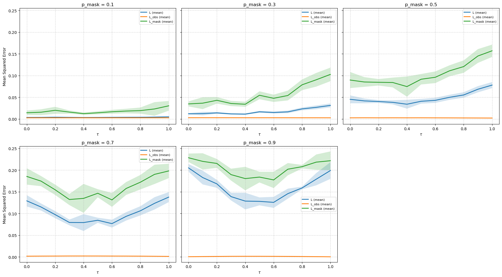

## Test Coherence on BERT, case study on Matrix Completion
In the original paper *"Abrupt Learning in Transformers: A Case Study on Matrix Completion" (NeurIPS 2024)*. [arXiv link](https://arxiv.org/abs/2410.22244), the aim is to train a model on a matrix completion task. To do this, the authors generate matrix, then randomly select positions of the elements of these matrix with a $p_{mask}$ proportion, and mask them before sending them to the model, which will attempt to predict them. 

For this mini-project, I want to test the model's sensitivity when the masked positions are selected according to a coherence-based criterion rather than uniformly as random, as in the original paper. To achieve this, I compute the local coherence for each generated matrix and select the positions to mask based on this coherence.

### Problem setup
We consider the **matrix completion** problem, where the goal is to recover a low-rank matrix $$M \in \mathbb{R}^{m \times n}$$ from a subset of its observed entries. Let $\Omega \subset [m] \times [n]$ denotes the set of observed indices, with $|\Omega| = (1-p_{mask})\cdot m*n$. The task is to recover $M$ from the projection $P_\Omega(M)$, where $P_\Omega$ keeps entries in $\Omega$ and sets others to zero.

### Matrix coherence
The coherence of a subspace quantifies how aligned its basis vectors are with the canonical axes. For a rank-`r` matrix `M = U Σ Vᵀ`, where `U ∈ ℝ^{m×r}` and `V ∈ ℝ^{n×r}`,  
the **row** and **column coherence** are defined as:
```
    μᵢ(U) = (m / r) * max ||P_U eᵢ||₂      μⱼ(V) = (n / r) * max ||P_V eⱼ||₂
```

where `P_U = U Uᵀ`, `P_V = V Vᵀ`, and `eᵢ` are canonical basis vectors.

### Coherence-Based Sampling
Instead of sampling uniformly at random, **coherence-based sampling** biases the mask toward more or less coherent entries.
I use τ ∈ [0, 1] to control this bias:

- If τ = 1, I select all the positions with the highest local coherence and apply the $p_{mask}$ ∈ {0, 1} proportion on these positions. 

- If τ = 0.5, I select the top 50% of positions according to their local coherence and apply the $p_{mask}$ proportion on these selected positions and I complete the remaining 50% by masking the positions randomly.

- If τ = 0, no coherence-based selection is done, and the masked positions are chosen entirely at random according to $p_{mask}$.

This ensures that exactly $p_{mask}\cdot(m*n)$ entries are masked in each matrix, with a fraction τ determined by coherence, while the remaining $(1-τ)\cdot|\Omega|$ entries (if τ < 1) can be chosen uniformly at random.

Our hypothesis was that, coherence-based sampling could improve recovery by prioritizing informative entries, as suggested by [*Chen, Y., Bhojanapalli, S., Sanghavi, S., & Ward, R. (2014). Coherent Matrix Completion. In Proceedings of the 31st International Conference on Machine Learning (ICML 2014)*](https://proceedings.mlr.press/v32/chenc14.html).

### Experimental setup
- Model: BERT trained for matrix completion (as in the original paper) with the same parameters 

### Results
The results show that, the masking strategy has a strong impact on model performance:
- When **τ = 1 (fully coherence-based masking)** as shown in [Fig 1], the model performance decreases significantly compared to uniform masking (τ = 0, [Fig 2]). The sudden drop in loss that is present in the original paper (τ = 0) is completly absent under fully coherent masking. For intermediate coherence (τ = 0.5, [Fig 3]), the sudden drop is partially recovered, although it is still weaker than in the uniform masking case.

- **Role of randomness**: These observations suggest that the Transformer relies on a certain degree of randomness in the masked entries to generalize effectively.

- **Bias induced by coherence-based masking**: Uniform masking appears to promote more robust learning, while coherence-focused masking introduces strong sampling bias, which reduces recovery performance.

|  |  |  |
|:--:|:--:|:--:|
| *Fig. 1 – Coherence-based masking (tau=1)* | *Fig. 2 – Coherence-based masking (tau=0)* | *Fig. 3 – Coherence-based masking (tau=0.5)* |

### Conclusion
- This experiment indicates that BERT (Transformers) trained for matrix completion are sensitive to structured masking patterns.
- High-coherence masking (τ = 1) hinders learning, whereas random masking (τ = 0) preserves generalization.

[Fig 4] and [Fig 5] respectively show on the same image the evolution of the error according to tau during the training
|  |  |
|:--:|:--:|
| *Fig. 4 – Train loss (L) evolution* | *Fig. 5 – Mask loss (L_mask) evolution* |

### Discusion
These results contradict the initial hypothesis that coherence-based sampling might enhance convex recovery.
While the theory of Chen et al. (2014) shows that coherence-aware sampling can reduce sample complexity in some structured settings, our findings indicate that strong coherence bias actually hurts recovery when the sampling becomes too localized.

In contrast, uniform random masking (τ=0) ensures an even distribution of observations across the matrix, preserving the incoherence condition necessary for stable recovery.
Moderate coherence levels (τ≈0.3−0.5) can still maintain acceptable performance, suggesting that a limited bias may help exploit structured information without violating these assumptions

## Additional Experiment — Coherence based in Convex Methods
I also tested the impact of local coherence on convex approaches for matrix completion, in particular Nuclear Norm Minimization problem, formulated as:

The matrix completion problem can be formulated as:

    min ||X||_*  s.t.  X_ij = M_ij  for all (i, j) ∈ Ω

where:
- `||X||_* = Σ σ_i(X)` is the nuclear norm (sum of singular values),
- `M ∈ ℝ^{m×n}` is the observed low-rank matrix,
- `Ω ⊂ [m]×[n]` is the set of observed entries.


### Experimental setup
- Parameters:
    - Masking proportion `p_mask` ∈ `{0.1, 0.3, 0.5, 0.7, 0.9}`
    - Coherence control parameter τ ∈ [0, 1]
- Metric: Mean Squared Error (MSE) on observed, masked, and total entries.

For each configuration, I ran the solver multiple times with different random seeds and plotted the mean ± standard deviation to ensure consistent and robust comparisons

### Results
[Fig 6] shows the effect of coherence-based masking on the reconstruction performance of the convex low-rank solver
1. Total reconstruction error (`L_mean`) and masked-entry error (`L_mask_mean`) increase with τ.  
2. Error on observed entries (`L_obs_mean`) remains nearly constant.  
3. Low masking rates (`p_mask ≤ 0.3`) tolerate coherence reasonably well, while higher masking rates (`p_mask ≥ 0.5`) exhibit a sharp degradation when τ → 1.

These results confirm that, coherence-based masking significantly reduces recovery performance, especially for large fractions of missing entries, demonstrating the sensitivity of convex low-rank recovery methods to mask structure.

 
 *Fig. 6 – MSE evolution according to tau for different p_mask* 

## Future work
As future work, 
- we will test how are LLMs sensitive to coherence in-context, in a case study on sparse recovery and matrix factorization, inspired by the paper : [*"What Can Transformers Learn In-Context? A Case Study of Simple Function Classes" (Garg et al., 2022)."*](https://arxiv.org/pdf/2208.01066)
- we will also test the model for inputs based on low coherence

## To reproduce this work
### Setup 
```bash
git clone https://github.com/ptalom/test_coherence_on_BERT_with_matrix_completion.git
cd test_coherence_on_BERT_with_matrix_completion
cd src
```

### Getting started
Install the dependencies using Conda
```bash
conda env create -f env.yaml
conda activate coherence_sampling
```

### Training
```bash
python train.py --config configs/train.yaml
```

### Contributor
- Patrick C. Talom